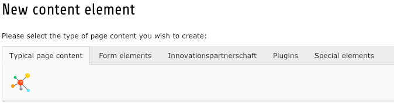
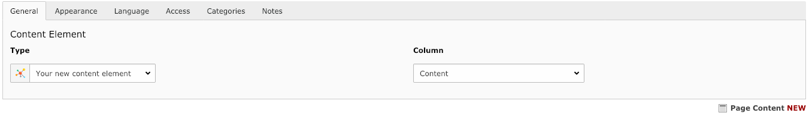
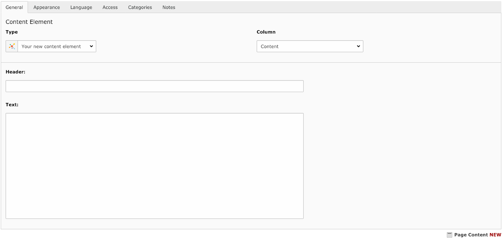

#  Content element registry
Typo3 extension simplify process of creating new content elements (CE) in [Typo3 way](https://docs.typo3.org/typo3cms/extensions/fluid_styled_content/7.6/AddingYourOwnContentElements/Index.html)


## Install
Install extension via composer `composer req digitalwerk/content-element-registry` and activate it in Extension module


## Setup
After activating extension, you have to define your Content elements configuration classes.
It can be done in two ways:

1. By defining paths in extension configuration (aka *extConf*). Can contain comma separated list of paths to directories
**Example:** `EXT:your_ext_1/Classes/ContentElements/,EXT:your_ext_2/Classes/ContentElements/` 

2. By registering Signal slot in `ext_localconf.php` of your extension as follows:

```php
<?php
$signalSlotDispatcher = \TYPO3\CMS\Core\Utility\GeneralUtility::makeInstance(
    \TYPO3\CMS\Extbase\SignalSlot\Dispatcher::class
);
$signalSlotDispatcher->connect(
    \YourVendor\ContentElementRegistry\Core\ContentElementRegistry::class,
    'registerContentElementRegistryClass',
    \YourVendor\YourExtension\::class,
    'yourMethodName'
);
```

Method `\YourVendor\YourExtension\::yourMethodName` can looks like this:

```php
<?php
/**
 * @param \YourVendor\ContentElementRegistry\Core\ContentElementRegistry $contentElementRegistry
 */
public function registerContentElements(\YourVendor\ContentElementRegistry\Core\ContentElementRegistry $contentElementRegistry)
{
    $contentElementsClassMap = \Composer\Autoload\ClassMapGenerator::createMap(PATH_typo3conf.'ext/your_extension/Classes/ContentElement/');
    foreach ($contentElementsClassMap as $elementClass => $elementClassPath) {
        $contentElementRegistry->registerContentElement(\TYPO3\CMS\Core\Utility\GeneralUtility::makeInstance($elementClass));
    }
}
```


## Creating new content element
To create new Content element you have to create new *Class* inside your folder defined in [Setup section](#setup) which extends `YourVendor\ContentElementRegistry\ContentElement\AbstractContentElementRegistryItem`
```php
<?php
namespace \YourVendor\YourExtension\ContentElement;

use YourVendor\ContentElementRegistry\ContentElement\AbstractContentElementRegistryItem;

class YourNewContentElement extends AbstractContentElementRegistryItem
{

}
```

After clearing typo3 caches you should now see new content element in wizard


As you can see, there is either title nor description of the content element. These are automatically fetched and translated from locallang file inside of your extension:
`EXT:your_extension/Resources/Private/Language/locallang_db.xlf`. You can now define your CE title and description as follows:
```xml
<trans-unit id="tt_content.yourextension_yournewcontentelement.title">
    <source>Your new content element</source>
</trans-unit>
<trans-unit id="tt_content.yourextension_yournewcontentelement.description">
    <source>Your new content element description</source>
</trans-unit>
```

When you add this new CE it will contains only default CE fields:


### Adding CE fields
To add new fields you have to define it in `\YourVendor\YourExtension\ContentElement\YourNewContentElement`:
```php
<?php
namespace \YourVendor\YourExtension\ContentElement;

use YourVendor\ContentElementRegistry\ContentElement\AbstractContentElementRegistryItem;

class YourNewContentElement extends AbstractContentElementRegistryItem
{

    /**
     * YourNewContentElement constructor.
     * @throws \Exception
     */
    public function __construct()
    {
        parent::__construct();
        $this->addPalette(
            'default',
            'header, --linebreak--, bodytext'
        );
    }
}
```

By this, we defined new CE *palette* with name `default` with two fields `header` and `bodytext`.

**Code description:**
1. Name of the palette must be unique per CE. Label for palette can be defined in `locallang_db.xlf` with following key: `tt_content.yourextension_yournewcontentelement.palette.default`
2. Fields definition syntax must follows [TCA palette showitem syntax](https://docs.typo3.org/typo3cms/TCAReference/Palettes/Index.html#showitem)
3. Used fields must be properly configured in [Typo3 TCA](https://docs.typo3.org/typo3cms/TCAReference/8.7/)
4. You can add as many palettes as you need ;)

Our CE now should looks like this:


If you need to override field configuration you can do this in this way: (In following example we enabled rich text editor for `bodytext` field)
```php
<?php
    /**
     * @return array
     */
    public function getColumnsOverrides()
    {
        return [
            'bodytext' => [
                'config' => [
                    'enableRichtext' => true,
                ],
            ],
        ];
    }
```


### CE Template
Template path of content element must be configured in typoscript as follow:

```typo3_typoscript
lib.contentElement {
    layoutRootPaths {
        10 = EXT:your_extension/Resources/Private/Layouts
    }

    partialRootPaths {
        10 = EXT:your_extension/Resources/Private/Partials
    }

    templateRootPaths {
        10 = EXT:your_extension/Resources/Private/Templates/ContentElements
    }
}
```

Template name is matched by CE class name. E.g. if is registered CE with class name `YourNewContentElement` this
template must exists `EXT:your_extension/Resources/Private/Templates/ContentElements/YourNewContentElement.html`.
Content of template can looks like this:

```html
<html xmlns="http://www.w3.org/1999/xhtml" lang="en"
      xmlns:f="http://typo3.org/ns/TYPO3/Fluid/ViewHelpers"
      data-namespace-typo3-fluid="true">

<f:layout name="ContentElements/{contentElement.layout}" />

<f:section name="Main">
  ...
</f:section>

<f:section name="Preview">
  ...
</f:section>

</html>
```

Whether you use `<f:layout />` and `<f:section />` it's fully up to you. You can also add section 
`<f:section name="Preview">` which is used for BE preview.

### CE Icon
If you don't want to use the defaut icon, you can change it:
- Add files with an icon to the folder `EXT:your_extension/Resources/Public/Icons`
- Rename icon file, ***Icon file must also have the same name as CE***, e.g. `yourextension_yournewcontentelement`

### CE Domain Model
Model name is matched by CE class name. E.g. if is registered CE with class name `YourNewContentElement` this model can
exists `EXT:your_extension/Classes/Domain/Model/YourNewContentElement.php` Content of model can 
looks like this:
```php
<?php
namespace \YourVendor\YourExtension\Domain\Model\ContentElement;

use DigitalWerk\ContentElementRegistry\Domain\Model\ContentElement;

/**
 * Class YourNewContentElement
 * @package YourVendor\YourExtension\Domain\Model\ContentElement
 */
class YourNewContentElement extends ContentElement
{

}
```
Into class you can write some `functions, getters, setters, etc`. Some of them are inherited from 
`DigitalWerk\ContentElementRegistry\Domain\Model\ContentElement`.

##### Model in template
The whole model is accessible in the template of this element. 
To find out what data is loaded in the model in the template use `<f:debug>{contentElement}</f:debug>`.

## Create a new field and setup
#### Create a new field
1. Create a field in the table `ext_table.sql`, e.g. `new_field`.
2. In the TCA `EXT:your_extension/Configuration/TCA/Overrides/tt_content.php` create new column and config [Typo3 Columns Config](https://docs.typo3.org/m/typo3/reference-tca/master/en-us/ColumnsConfig/Index.html):
```php
 'columns' => [
        'new_field' => [
            'label' => 'New field',
        ],
    ],
```
#### Setup a new field
- In Class `\YourVendor\YourExtension\ContentElement\YourNewContentElement` add created field `new_field`:
```php
<?php
namespace \YourVendor\YourExtension\ContentElement;

use YourVendor\ContentElementRegistry\ContentElement\AbstractContentElementRegistryItem;

class YourNewContentElement extends AbstractContentElementRegistryItem
{

    /**
     * YourNewContentElement constructor.
     * @throws \Exception
     */
    public function __construct()
    {
        parent::__construct();
        $this->addPalette(
            'default',
            'new_field'
        );
    }
}
```
- In Model of CE `EXT:your_extension/Classes/Domain/Model/YourNewContentElement.php` add property of created field `$newField`.
**You must follow the syntax**, e.g. `new_field` which is written in ext_table.php, you must write `newField` in the model.

## Content element with IRRE
#### Mapping
Map in `ext_typoscript_setup.typoscript` relation table to CE model:
```typo3_typoscript
      YourVendor\YourExtension\Domain\Model\ContentElement\YourNewContentElement\YourNewRelation {
        mapping {
         tableName = tx_contentelementregistry_domain_model_relation
         recordType = yourextension_yournewcontentelement_yournewrelation
        }
      }
```
#### Register relation icon
You can register relation icon using [Typo3 Icon API](https://docs.typo3.org/m/typo3/reference-coreapi/master/en-us/ApiOverview/Icon/Index.html#registration)

#### Relation TCA
In TCA `EXT:your_extension/Configuration/TCA/Overrides/tx_contentelementregistry_domain_model_relation.php` create:
```php

$tempTca = [
    'ctrl' => [
        'typeicon_classes' => [
            'yourextension_yournewcontentelement_yournewrelation' => 'yourextension_yournewcontentelement_yournewrelation',
        ],
    ],
    'types' => [
        'yourextension_yournewcontentelement_yournewrelation' => [
                    'showitem' => '--palette--;;mediaPalette,',           
                ],
    ],
    'palettes' => [
        'mediaPalette' => [
            'showitem' => 'title, media',
        ],
    ],
    'columns' => [
        'title' => [
            'label' => 'Title',
            'config' => [
                'type' => 'text',
            ],
        ],

    ],
];

$GLOBALS['TCA']['tx_contentelementregistry_domain_model_relation'] = array_replace_recursive($GLOBALS['TCA']['tx_contentelementregistry_domain_model_relation'], $tempTca);

```
#### Relation add to CE
Add name of relation to palette:
```php
<?php
namespace \YourVendor\YourExtension\ContentElement;

use YourVendor\ContentElementRegistry\ContentElement\AbstractContentElementRegistryItem;

class YourNewContentElement extends AbstractContentElementRegistryItem
{
  public function __construct()
    {
        parent::__construct();
        $this->addPalette(
            'default',
            'tx_contentelementregistry_relations'
        );
    }
}
```

#### Relation model
- In model of CE create property and getter:
```php
<?php
namespace \YourVendor\YourExtension\Domain\Model\ContentElement;

use DigitalWerk\ContentElementRegistry\Domain\Model\ContentElement;

/**
 * Class YourNewContentElement
 * @package YourVendor\YourExtension\Domain\Model\ContentElement
 */
class YourNewContentElement extends ContentElement
{
    /**
     * @var \TYPO3\CMS\Extbase\Persistence\ObjectStorage<\YourVendor\YourExtension\Domain\Model\ContentElement\YourNewContentElement\YourNewRelation>
     */
    protected $relations = null;

    /**
     * @return ObjectStorage|null
     */
    public function getRelations(): ? ObjectStorage
    {
        return $this->relations;
    }

}
```
- Create a new file `YourNewRelation.php` in `\YourVendor\YourExtension\Domain\Model\ContentElement\YourNewContentElement`.
Here you can write getters and properties for fields in TCA of Relation:

```php
<?php
namespace \YourVendor\YourExtension\Domain\Model\ContentElement\YourNewContentElement;

use Digitalwerk\ContentElementRegistry\Domain\Model\Relation;

/**
 * Class YourNewRelation
 * @package YourVendor\YourExtension\Domain\Model\ContentElement\YourNewContentElement
 */
class YourNewRelation extends Relation
{
    /**
     * @var string
     */
    protected $type = '';
    
    /**
     * @return string
     */
    public function getType(): string
    {
        return $this->type;
    }

}
```

## CE field mapping
In Class of CE you can map field, when you want to use it in model, e.g. `tx_contentelementregistry_relations` is called in the model `txContentelementregistryRelation`,
but after mapping `'tx_contentelementregistry_relations' => 'relations'`,`tx_contentelementregistry_relations` is called in the model `relations`.
 ```php
namespace \YourVendor\YourExtension\Domain\Model\ContentElement;
 
use DigitalWerk\ContentElementRegistry\Domain\Model\ContentElement;
 
/**
 * Class YourNewContentElement
 * @package YourVendor\YourExtension\Domain\Model\ContentElement
 */
class YourNewContentElement extends ContentElement
{
   /**
    * @var array
    */
   protected $columnsMapping = [
       'tx_contentelementregistry_relations' => 'relations',
   ];
 
}
```


